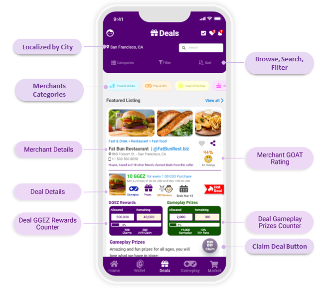

# Deals Marketplace

Merchants promote their businesses by posting deals and running loyalty programs on the platform; with each deal, merchants allocate GGEZ rewards tokens, giveaways, and prizes for members to collect.

* Members browse the deals marketplace for great deals by searching the **localized deals catalog**.
* **Merchants Details:** members view the merchant contact details, members’ ratings and reviews, and the deal details.
* **Deal Details:** The deal section shows members the deal details, deal end date, if the deal includes games and prizes, how much GGEZ rewards are allocated and remaining for the deal, and how many prizes are allocated and remaining for the deal.
* **GOAT Rating:** GOAT stands for (**greatest of all time**); the GOAT score is based on members’ **deal ratings** after they claim deals. It is a trusted measurement of **merchant recommendations** by the platform members.
* The GOAT-meter score levels are: **Super GOAT**: when the rating score is above 90%. **GOAT**: When the rating score is between 80-90%. **Baby GOAT**: when the rating score is between 50%-80%. **Dead GOAT**: When the rating score is less than 50%.
* **Deal Claim:** when members claim the deal, they earn the GGEZ rewards tokens and get presented with an option to play an **engaging multiuser AR game** hosted by a **3D avatar** and sponsored by the merchant for a chance of winning additional surprises.
* **Real Ratings & Reviews:** Because users rate merchants after receiving the crypto rewards, user ratings and reviews are linked to the crypto transaction, minimizing fake users’ ratings and reviews.
